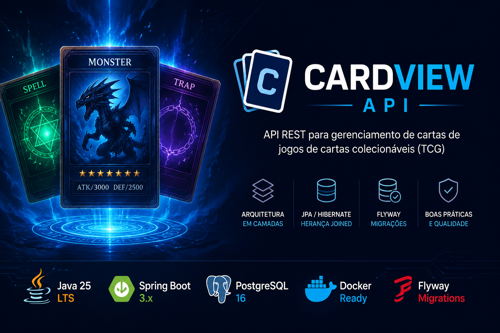

<div align="center">

# CardView API

API REST desenvolvida com **Java 25 (LTS) e Spring Boot** para gerenciamento de cartas inspiradas em jogos de cartas colecionáveis (TCG).

Projeto criado com foco em **arquitetura em camadas, modelagem orientada a objetos, JPA/Hibernate, boas práticas de desenvolvimento backend e construção de portfólio**.




</div>

---

## Visão geral

O **CardView API** é uma API REST que permite o gerenciamento de diferentes tipos de cartas, aplicando conceitos comuns em aplicações backend desenvolvidas com Spring Boot.

O projeto utiliza **herança com JPA**, **versionamento de banco com Flyway**, **PostgreSQL em Docker** e uma arquitetura organizada por responsabilidades.

Além de ser um projeto funcional, ele foi desenvolvido para demonstrar conhecimentos em:

* Java moderno
* Spring Boot
* Spring Data JPA
* Hibernate
* PostgreSQL
* Docker
* Flyway
* Design orientado a objetos

---

# Demonstração da arquitetura

## Arquitetura em camadas

```text
Cliente (Postman / Front-end)
            |
            v
      REST Controllers
            |
            v
         Services
            |
            v
      Spring Repositories
            |
            v
   PostgreSQL + Flyway
```

O projeto adota uma **arquitetura em camadas com baixo acoplamento entre as responsabilidades**, facilitando manutenção, testes e evolução da aplicação.

---

# Modelo de domínio

A entidade `Card` é a classe base do sistema e utiliza **InheritanceType.JOINED** para representar diferentes tipos de cartas.

```text
                Card
                  |
    ---------------------------------
    |               |              |
MonsterCard     SpellCard      TrapCard
```

## Atributos comuns

Todas as cartas compartilham informações como:

* nome
* código (passcode)
* descrição
* status
* imagem
* data de criação
* data de atualização

As especializações adicionam seus próprios atributos, como ataque, defesa, nível, atributo e raça.

---

# Tecnologias utilizadas

| Tecnologia      | Finalidade                    |
| --------------- | ----------------------------- |
| Java 25 (LTS)   | Linguagem principal           |
| Spring Boot     | Framework backend             |
| Spring Data JPA | Persistência                  |
| Hibernate       | ORM                           |
| PostgreSQL      | Banco de dados                |
| Flyway          | Migrações                     |
| Maven           | Gerenciamento de dependências |
| Docker          | Infraestrutura local          |

---

# Estrutura do projeto

```text
src
└── main
    ├── java
    │   └── br.com.lordsabino.cardview
    │       ├── controller
    │       ├── dto
    │       ├── model
    │       │   ├── base
    │       │   ├── cards
    │       │   └── enums
    │       ├── repository
    │       ├── service
    │       └── CardviewApplication.java
    │
    └── resources
        ├── db
        │   └── migration
        └── application.yml
```

---

# Banco de dados

O projeto utiliza **Flyway** para controlar a evolução do esquema do banco de dados.

As migrações ficam em:

```text
src/main/resources/db/migration
```

Exemplo:

```text
V1__create_cards_tables.sql
```

Dessa forma, qualquer ambiente pode reproduzir o banco de forma consistente.

---

# Como executar

## Pré-requisitos

* Java 25 (LTS)
* Maven
* Docker
* Docker Compose

## 1. Clonar o repositório

```bash
git clone https://github.com/lordsabino/cardview.git
cd cardview
```

## 2. Subir o PostgreSQL

```bash
docker compose up -d
```

## 3. Executar a aplicação

### Linux / macOS

```bash
./mvnw spring-boot:run
```

### Windows

```bash
mvnw.cmd spring-boot:run
```

A API estará disponível em:

```text
http://localhost:8080
```

---

# Configuração do banco

Exemplo de `application.yml`:

```yaml
spring:
  datasource:
    url: jdbc:postgresql://localhost:5432/cardview
    username: postgres
    password: postgres

  jpa:
    hibernate:
      ddl-auto: validate

  flyway:
    enabled: true
```

---

# Exemplo de endpoints

> **Observação:** os endpoints abaixo representam a estrutura planejada da API e serão implementados ao longo do desenvolvimento do projeto.

## Criar um monstro

```http
POST /api/monsters
```

### Requisição

```json
{
  "name": "Blue-Eyes White Dragon",
  "passcode": "89631139",
  "description": "Este lendário dragão é uma poderosa máquina de destruição.",
  "attribute": "LIGHT",
  "monsterRace": "DRAGON",
  "level": 8,
  "attack": 3000,
  "defense": 2500
}
```

### Resposta

```json
{
  "id": 1,
  "name": "Blue-Eyes White Dragon",
  "attack": 3000,
  "defense": 2500
}
```

## Buscar todas as cartas

```http
GET /api/cards
```

---

# Conceitos aplicados

Este projeto utiliza diversas práticas comuns em aplicações Spring Boot.

## Persistência

* JPA
* Hibernate
* Herança JOINED
* Enum como STRING
* Relacionamentos entre entidades

## Arquitetura

* Controllers
* Services
* Repositories
* DTOs
* Entidades separadas da API

## Infraestrutura

* Docker
* PostgreSQL
* Flyway
* Maven

---

# Boas práticas

* separação de responsabilidades
* encapsulamento do domínio
* versionamento de banco
* uso de DTOs
* enums tipados
* entidades especializadas
* estrutura preparada para testes

---

# Roadmap

## Em desenvolvimento

* CRUD completo
* DTOs de request/response
* validações com Bean Validation
* tratamento global de exceções
* paginação
* filtros
* documentação OpenAPI

## Futuras melhorias

* autenticação JWT
* autorização por perfis
* testes unitários
* testes de integração
* cache
* monitoramento
* CI/CD com GitHub Actions

---

# Documentação da API

Planejada integração com **Swagger / OpenAPI**.

Após implementação:

```text
http://localhost:8080/swagger-ui/index.html
```

---

# Testes

Estrutura planejada:

```text
src/test/java
├── controller
├── service
├── repository
└── integration
```

Ferramentas previstas:

* JUnit 5
* Mockito
* Spring Boot Test
* Testcontainers

---

# Aprendizados

Durante o desenvolvimento deste projeto foram explorados temas como:

* modelagem de domínio
* herança em bancos relacionais
* ciclo de vida de entidades
* migrações
* organização de projetos Spring
* integração com PostgreSQL
* construção de APIs REST

---

# Autor

**Rodrigo Sabino**

Projeto desenvolvido para estudo, prática e evolução em **Java Backend com Spring Boot**.

Contribuições, sugestões e feedbacks são sempre bem-vindos.

---

# Licença

Este projeto está licenciado sob a **MIT License**.

Você pode utilizar, modificar e distribuir este projeto livremente, desde que mantenha o aviso de copyright e a licença original.

Consulte o arquivo [LICENSE](LICENSE) para mais informações.

---

<div align="center">

Desenvolvido com **Java 25 (LTS), Spring Boot e PostgreSQL**.

</div>
